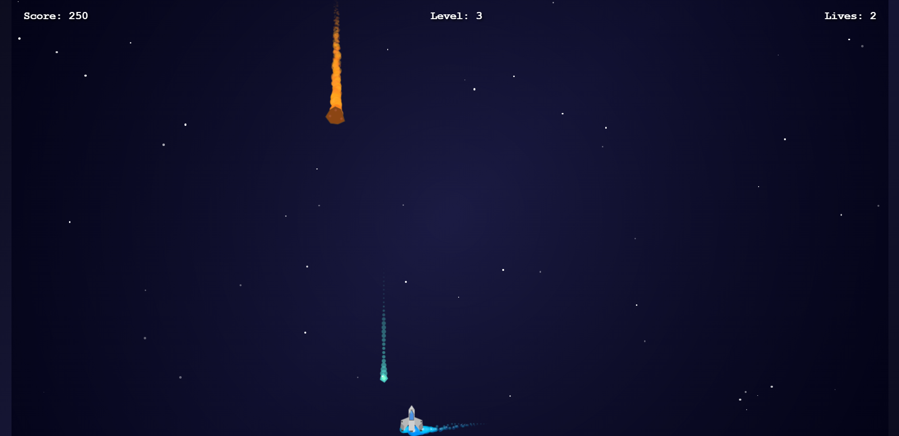

# 🚀✨ Space Shooter Game

<p align="center">
  
</p>

<p align="center">
  
  
  
  
</p>

---

## 🌌 Live Demo

🔗 **Play Now:** https://space-shooter-pi.vercel.app/

---

## 🎮 Game Preview

<p align="center">
  
</p>

---

## 🎮 Gameplay Instructions

🕹️ How to Play:

* 🚀 Drag to move your spaceship
* 🔫 Tap to shoot bullets
* 💎 Collect crystals to increase score
* ☄️ Destroy asteroids
* ❤️ Avoid losing all lives

---

## 📸 Gameplay Preview

<p align="center">
  
</p>

---

## ✨ Features

🌟 Smooth gameplay experience
🚀 Drag-based movement
🔫 Shooting system
💎 Score collection mechanics
☄️ Dynamic obstacles
❤️ Lives system
📈 Level progression
🔊 Sound effects
🌈 Particle animations
📱 Mobile-friendly

---

## 🛠️ Tech Stack

<p align="center">
  
</p>

* HTML5 Canvas 🎨
* CSS3 ✨
* JavaScript ⚡

---

## 📂 Project Structure

```bash
📁 space-shooter-game
 ├── index.html
 ├── gameplay.png (optional)
 └── README.md
```

---

## 🚀 Run Locally

```bash
git clone https://github.com/your-username/space-shooter-game.git
cd space-shooter-game
open index.html
```

---

## 🔥 Highlights

✨ Lightweight project
✨ No frameworks used
✨ Smooth animations
✨ Works on all devices

---

## 💡 Future Improvements

🧠 AI enemies
🎵 Background music
🏆 Leaderboard
⚡ Power-ups

---

## 🤝 Contributing

1. Fork 🍴
2. Create branch 🌿
3. Make changes ✨
4. Commit 📌
5. Push 🚀
6. Open PR 🔥

---

## ⭐ Support

If you like this project:

⭐ Star the repo
📢 Share it
👨‍💻 Follow for more

---

## 👨‍💻 Author

💖 Made with passion by KAVIN

---

<p align="center">
  🚀 Keep Building • 💡 Keep Learning • 🌟 Keep Growing
</p>
